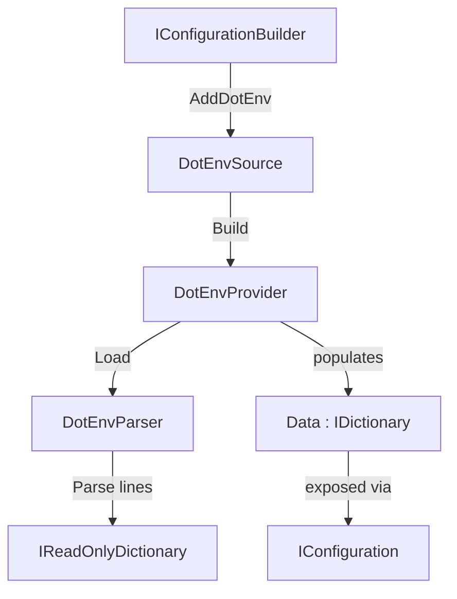

# Design Document — Sagi.Sdk.DotEnv

## Overview

O `Sagi.Sdk.DotEnv` integra arquivos `.env` ao pipeline de configuração nativo do .NET (`IConfiguration` / `IConfigurationBuilder`). Ele implementa um `IConfigurationSource` e um `IConfigurationProvider` seguindo o mesmo padrão extensível dos demais providers do `Microsoft.Extensions.Configuration` — sem dependências externas além desse pacote.

O SDK expõe dois métodos de extensão em `IConfigurationBuilder`:

```csharp
builder.AddDotEnv();                          // usa defaults: diretório atual + ".env"
builder.AddDotEnv(opt => {
    opt.Directory = "/app/config";
    opt.FileName  = ".env.production";
});
```

Após o carregamento, as variáveis do arquivo `.env` ficam acessíveis via `IConfiguration` da mesma forma que qualquer outra fonte — `appsettings.json`, variáveis de ambiente, etc. — respeitando a ordem de precedência padrão do .NET (última fonte adicionada tem prioridade).

---

## Architecture

O SDK segue o padrão de extensão de configuração do .NET:



**Fluxo de execução:**

1. O consumidor chama `AddDotEnv()` ou `AddDotEnv(Action<DotEnvOptions>)` no `IConfigurationBuilder`.
2. O método de extensão cria um `DotEnvSource` com as opções resolvidas e o adiciona à coleção `Sources` do builder.
3. Quando o `IConfiguration` é construído, o builder chama `DotEnvSource.Build()`, que instancia e retorna um `DotEnvProvider`.
4. O `DotEnvProvider.Load()` é chamado pelo framework. Ele lê o arquivo (se existir), delega o parsing ao `DotEnvParser` e popula o dicionário `Data` herdado de `ConfigurationProvider`.
5. As entradas ficam disponíveis via `IConfiguration["CHAVE"]`.

**Decisão de design — ausência de arquivo não é erro:**
Seguindo o comportamento do `JsonConfigurationProvider` com `optional: true`, o `DotEnvProvider` não lança exceção quando o arquivo não existe. Isso permite que o SDK seja adicionado ao pipeline sem exigir que o arquivo `.env` esteja presente em todos os ambientes (ex.: produção pode usar variáveis de ambiente reais).

---

## Components and Interfaces

### `DotEnvOptions`

Encapsula as opções de localização do arquivo `.env`.

```csharp
namespace Sagi.Sdk.DotEnv.Options;

public class DotEnvOptions
{
    public string Directory { get; set; } = System.IO.Directory.GetCurrentDirectory();
    public string FileName  { get; set; } = ".env";
}
```

- `Directory`: diretório onde o arquivo será buscado. Default: `Directory.GetCurrentDirectory()`.
- `FileName`: nome do arquivo. Default: `".env"`.
- A validação (nulo/vazio) é responsabilidade do `DotEnvSource`, não da própria classe de opções.

---

### `DotEnvParser`

Componente stateless responsável por transformar linhas de texto em pares chave-valor.

```csharp
namespace Sagi.Sdk.DotEnv.Parser;

public static class DotEnvParser
{
    public static IReadOnlyDictionary<string, string> Parse(IEnumerable<string> lines);
}
```

**Regras de parsing (aplicadas em ordem):**

| Condição | Ação |
|---|---|
| Linha nula, vazia ou só whitespace | Ignorar |
| Linha começa com `#` (após trim) | Ignorar (comentário) |
| Linha não contém `=` | Ignorar |
| Chave (parte antes do primeiro `=`) vazia após trim | Ignorar |
| Linha válida `CHAVE=VALOR` | Adicionar ao dicionário com trim em chave e valor |

**Split no primeiro `=`:** usa `line.Split('=', 2)` para preservar `=` no valor.

**Decisão de design — método estático:**
O parser não tem estado e não depende de serviços externos. Um método estático é suficiente, evita alocação desnecessária e facilita o teste direto sem instanciação.

---

### `DotEnvSource`

Implementa `IConfigurationSource`. Valida as opções no construtor e cria o `DotEnvProvider`.

```csharp
namespace Sagi.Sdk.DotEnv.Provider;

public class DotEnvSource : IConfigurationSource
{
    private readonly DotEnvOptions _options;

    public DotEnvSource(DotEnvOptions options)
    {
        ArgumentException.ThrowIfNullOrEmpty(options.Directory);
        ArgumentException.ThrowIfNullOrEmpty(options.FileName);
        _options = options;
    }

    public IConfigurationProvider Build(IConfigurationBuilder builder)
        => new DotEnvProvider(_options);
}
```

**Decisão de design — validação no construtor do Source:**
A validação ocorre no momento em que o source é adicionado ao builder (não no `Load()`), fornecendo feedback imediato ao desenvolvedor. Segue o mesmo padrão de `ArgumentException.ThrowIfNullOrEmpty` usado em `Error.cs` e `MongoOptions`.

---

### `DotEnvProvider`

Herda `ConfigurationProvider` do .NET. Sobrescreve `Load()` para ler o arquivo e popular `Data`.

```csharp
namespace Sagi.Sdk.DotEnv.Provider;

public class DotEnvProvider : ConfigurationProvider
{
    private readonly DotEnvOptions _options;

    public DotEnvProvider(DotEnvOptions options)
        => _options = options;

    public override void Load()
    {
        string filePath = Path.Combine(_options.Directory, _options.FileName);

        if (!File.Exists(filePath))
            return;

        IEnumerable<string> lines = File.ReadAllLines(filePath);
        IReadOnlyDictionary<string, string> entries = DotEnvParser.Parse(lines);

        Data = new Dictionary<string, string?>(
            entries.ToDictionary(kvp => kvp.Key, kvp => (string?)kvp.Value),
            StringComparer.OrdinalIgnoreCase);
    }
}
```

**Decisão de design — `StringComparer.OrdinalIgnoreCase`:**
O `ConfigurationProvider` base usa `OrdinalIgnoreCase` por padrão. Manter essa convenção garante que `configuration["chave"]` e `configuration["CHAVE"]` retornem o mesmo valor, consistente com o comportamento de `appsettings.json`.

---

### `ConfigurationBuilderExtensions`

Dois overloads de extensão em `IConfigurationBuilder`.

```csharp
namespace Sagi.Sdk.DotEnv.Extensions;

public static class ConfigurationBuilderExtensions
{
    public static IConfigurationBuilder AddDotEnv(this IConfigurationBuilder builder)
        => builder.AddDotEnv(_ => { });

    public static IConfigurationBuilder AddDotEnv(
        this IConfigurationBuilder builder,
        Action<DotEnvOptions> configure)
    {
        DotEnvOptions options = new();
        configure(options);
        return builder.Add(new DotEnvSource(options));
    }
}
```

O overload sem argumentos delega ao overload com `Action<DotEnvOptions>` usando um delegate vazio, evitando duplicação de lógica.

---

## Data Models

### Formato do arquivo `.env`

```
# Comentário — linha ignorada
DATABASE_URL=postgres://localhost:5432/mydb
APP_SECRET=abc=def=ghi        # valor com = é preservado
  PADDED_KEY  =  padded value  # trim aplicado em chave e valor
LINHA_SEM_IGUAL                # ignorada
                               # linha vazia — ignorada
```

### Estrutura interna de dados

O `DotEnvProvider` popula o dicionário `Data` herdado de `ConfigurationProvider`:

```
IDictionary<string, string?> Data
  "DATABASE_URL" → "postgres://localhost:5432/mydb"
  "APP_SECRET"   → "abc=def=ghi"
  "PADDED_KEY"   → "padded value"
```

### `DotEnvOptions` — valores padrão

| Propriedade | Tipo | Default |
|---|---|---|
| `Directory` | `string` | `Directory.GetCurrentDirectory()` |
| `FileName` | `string` | `".env"` |

---

## Correctness Properties

*A property is a characteristic or behavior that should hold true across all valid executions of a system — essentially, a formal statement about what the system should do. Properties serve as the bridge between human-readable specifications and machine-verifiable correctness guarantees.*

O `DotEnvParser` é uma função pura (`IEnumerable<string>` → `IReadOnlyDictionary<string, string>`), o que o torna ideal para property-based testing. As propriedades abaixo cobrem os critérios de aceitação testáveis identificados no prework.

**Reflexão sobre redundância:**

- Os critérios 3.1 e 3.7 descrevem essencialmente a mesma propriedade de completude do parsing. O critério 5.6 também exige explicitamente um round-trip. Esses três são consolidados na **Property 1** (round-trip).
- Os critérios 3.2, 3.3 e 3.4 descrevem diferentes categorias de linhas inválidas que devem ser ignoradas. Eles são consolidados na **Property 3** (isolamento de linhas inválidas), pois todos testam que linhas inválidas não produzem entradas.
- O critério 1.3 e 4.3 descrevem o mesmo comportamento de carregamento correto de entradas — consolidados na **Property 1**.
- O critério 3.5 (valores com `=`) e 3.6 (trim) são propriedades distintas e permanecem separadas (**Property 2** e parte da **Property 1**).
- O critério 2.4 (combinação de caminho) é coberto por um teste de exemplo, não por PBT, pois testa `Path.Combine` do .NET.

---

### Property 1: Round-trip de parsing

*For any* conjunto de pares chave-valor válidos (chaves não vazias, sem `=` na chave, valores arbitrários), serializar esses pares como linhas no formato `CHAVE=VALOR` e fazer o parse com `DotEnvParser.Parse` deve retornar um dicionário contendo exatamente os mesmos pares, com chaves e valores idênticos após trim.

**Validates: Requirements 1.3, 3.1, 3.7, 4.3, 5.6**

---

### Property 2: Valores com `=` são preservados integralmente

*For any* chave válida e qualquer valor que contenha um ou mais caracteres `=`, o resultado do parsing deve preservar o valor completo (tudo após o primeiro `=` na linha), sem truncar nem modificar os `=` adicionais.

**Validates: Requirements 3.5**

---

### Property 3: Linhas inválidas não afetam o resultado

*For any* conjunto de linhas válidas intercaladas com linhas inválidas (vazias, whitespace-only, comentários iniciados com `#`, ou linhas sem `=`), o resultado do parsing deve conter exatamente as entradas das linhas válidas — as linhas inválidas não devem gerar entradas nem remover entradas válidas adjacentes.

**Validates: Requirements 3.2, 3.3, 3.4**

---

### Property 4: Idempotência do parsing

*For any* conteúdo de arquivo `.env`, chamar `DotEnvParser.Parse` duas vezes sobre as mesmas linhas deve produzir dicionários com os mesmos pares chave-valor em ambas as chamadas.

**Validates: Requirements 3.1, 3.7**

---

## Error Handling

| Situação | Comportamento |
|---|---|
| `DotEnvOptions.Directory` nulo ou vazio | `DotEnvSource` lança `ArgumentException` no construtor |
| `DotEnvOptions.FileName` nulo ou vazio | `DotEnvSource` lança `ArgumentException` no construtor |
| Arquivo `.env` não encontrado | `DotEnvProvider.Load()` retorna silenciosamente; `Data` permanece vazio |
| Linha malformada no arquivo | `DotEnvParser` ignora a linha; demais entradas são carregadas normalmente |
| Chave duplicada no arquivo | A última ocorrência prevalece (comportamento do `Dictionary`) |

**Decisão de design — sem exceção para arquivo ausente:**
Lançar exceção quando o arquivo não existe tornaria o SDK inutilizável em ambientes onde o `.env` é opcional (CI/CD, produção com variáveis de ambiente reais). O comportamento silencioso é consistente com `AddJsonFile(..., optional: true)`.

---

## Testing Strategy

### Abordagem dual

Os testes combinam testes de exemplo (xUnit) para comportamentos específicos e testes baseados em propriedades (FsCheck) para propriedades universais do parser.

**Biblioteca PBT:** [FsCheck](https://fscheck.github.io/FsCheck/) com integração xUnit via `FsCheck.Xunit`. Cada propriedade executa mínimo de 100 iterações.

### Testes de exemplo (xUnit)

**`DotEnvParserTests`**
- Linha válida `KEY=VALUE` → par correto
- Linha vazia → ignorada
- Linha só whitespace → ignorada
- Linha com `#` → ignorada
- Linha sem `=` → ignorada
- Valor com múltiplos `=` → valor preservado
- Trim em chave e valor
- Chave vazia após trim → ignorada

**`DotEnvProviderTests`**
- Arquivo existente com entradas válidas → `Data` populado corretamente
- Arquivo inexistente → sem exceção, `Data` vazio
- Arquivo vazio → sem exceção, `Data` vazio

**`DotEnvSourceTests`**
- `Directory` nulo → `ArgumentException`
- `Directory` vazio → `ArgumentException`
- `FileName` nulo → `ArgumentException`
- `FileName` vazio → `ArgumentException`
- Opções válidas → `Build()` retorna `DotEnvProvider`

**`ConfigurationBuilderExtensionsTests`**
- `AddDotEnv()` → `Sources` contém `DotEnvSource` com defaults
- `AddDotEnv(opt => ...)` → `Sources` contém `DotEnvSource` com opções customizadas
- `AddDotEnv()` com diretório e nome customizados → caminho combinado corretamente

### Testes de propriedade (FsCheck)

Cada teste de propriedade referencia a propriedade do design via comentário:
`// Feature: dotenv-sdk, Property N: <texto da propriedade>`

**Property 1 — Round-trip de parsing**
Gerador: conjuntos aleatórios de pares `(string key, string value)` onde a chave não contém `=` e não é whitespace-only. Serializar como `KEY=VALUE\n`, parsear, verificar que todos os pares estão presentes com valores idênticos.

**Property 2 — Valores com `=` preservados**
Gerador: chaves válidas aleatórias + valores aleatórios com pelo menos um `=` inserido em posição aleatória. Verificar que o valor completo é preservado.

**Property 3 — Isolamento de linhas inválidas**
Gerador: lista de linhas válidas intercaladas com linhas inválidas geradas aleatoriamente (strings whitespace, strings com `#` prefixado, strings sem `=`). Verificar que o resultado contém exatamente as entradas das linhas válidas.

**Property 4 — Idempotência**
Gerador: listas aleatórias de linhas (mix de válidas e inválidas). Verificar que `Parse(lines)` chamado duas vezes retorna dicionários com os mesmos pares.

### Configuração mínima de iterações

```csharp
[Property(MaxTest = 100)]
public Property RoundTrip_ParseAfterSerialize_ReturnsSamePairs() { ... }
```
