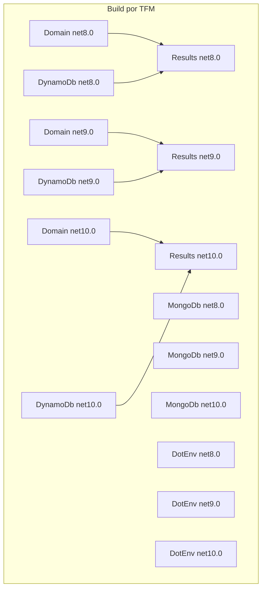

# Design Document — multi-target-sdk

## Overview

Esta feature configura multi-targeting nos 5 SDKs do monorepo Sagi para que cada biblioteca compile simultaneamente para .NET 8, .NET 9 e .NET 10. A mudança é essencialmente de configuração MSBuild: substituir `<TargetFramework>` (singular) por `<TargetFrameworks>` (plural) em cada `.csproj`, ajustar versões de dependências NuGet para o mínimo compatível com net8.0, e replicar a mesma mudança nos projetos de teste.

O resultado é que consumidores dos SDKs em projetos net8.0 ou net9.0 passam a ter suporte oficial, e os pacotes NuGet gerados incluem assemblies para os três frameworks na estrutura `lib/net8.0/`, `lib/net9.0/` e `lib/net10.0/`.

### Decisões de design

- **Sem código condicional por padrão**: nenhum dos 5 SDKs usa APIs exclusivas de .NET 10 que exijam `#if NET10_0_OR_GREATER`. A mudança é puramente de configuração.
- **Versões de dependências fixadas no mínimo compatível com net8.0**: evita usar ranges abertos e garante reprodutibilidade.
- **`global.json` mantido**: o arquivo usa `rollForward: latestMajor`, o que permite que o SDK .NET 10 compile para net8.0 e net9.0 sem instalar SDKs adicionais.

---

## Architecture

O monorepo não tem uma camada de orquestração própria — o MSBuild resolve o grafo de dependências automaticamente via `<ProjectReference>`. Com multi-targeting, o MSBuild compila cada projeto para cada TFM na ordem correta do grafo:

```
net8.0:  Results → Domain
         Results → AWS.DynamoDb
         (MongoDb e DotEnv são independentes)

net9.0:  idem
net10.0: idem
```

Quando `dotnet build Sagi.Sdk.sln` é executado, o MSBuild expande cada projeto em N targets (um por TFM) e resolve as `<ProjectReference>` para o TFM correspondente automaticamente — esse é o comportamento padrão do SDK-style projects com multi-targeting.



---

## Components and Interfaces

### Projetos de produção

Cada `.csproj` recebe a seguinte mudança central:

```xml
<!-- Antes -->
<TargetFramework>net10.0</TargetFramework>

<!-- Depois -->
<TargetFrameworks>net8.0;net9.0;net10.0</TargetFrameworks>
```

#### Sagi.Sdk.Results

Sem dependências externas. Mudança mínima: apenas a troca de `TargetFramework` → `TargetFrameworks`.

#### Sagi.Sdk.Domain

Sem dependências NuGet. Depende de `Sagi.Sdk.Results` via `<ProjectReference>`. O MSBuild resolve automaticamente o TFM correspondente.

#### Sagi.Sdk.DotEnv

Depende de `Microsoft.Extensions.Configuration`. A versão atual já é `8.0.0`, que é o mínimo compatível com net8.0 — nenhum ajuste necessário.

#### Sagi.Sdk.MongoDb

Depende de `Microsoft.Extensions.*` na versão `9.0.5` e `MongoDB.Driver 3.3.0`.

- `Microsoft.Extensions.*` versão `9.0.5` suporta net8.0 (os pacotes Microsoft.Extensions seguem o padrão de suportar TFMs anteriores). Nenhum ajuste necessário.
- `MongoDB.Driver 3.3.0` suporta `netstandard2.0` e `net6.0+`, portanto compatível com net8.0 e net9.0 sem ajuste.

#### Sagi.Sdk.AWS.DynamoDb

Depende de `AWSSDK.*` e `Microsoft.Extensions.Hosting 9.0.5`.

- `AWSSDK.*` versões `3.7.x` suportam `netstandard2.0` e são compatíveis com net8.0+.
- `Microsoft.Extensions.Hosting 9.0.5` suporta net8.0 (pacote multi-target da Microsoft).
- `Kralizek.Extensions.Configuration.AWSSecretsManager 1.7.0` suporta `netstandard2.0` — compatível.

Nenhum ajuste de versão necessário para este projeto.

### Projetos de teste

Os projetos em `tests/` recebem a mesma mudança de `TargetFramework` → `TargetFrameworks`. As dependências de teste (`xunit`, `coverlet`, `Microsoft.NET.Test.Sdk`) suportam net8.0+.

### Pacotes NuGet gerados

Com multi-targeting, `dotnet pack` gera automaticamente a estrutura:

```
lib/
  net8.0/
    Sagi.Sdk.*.dll
  net9.0/
    Sagi.Sdk.*.dll
  net10.0/
    Sagi.Sdk.*.dll
```

O `.nuspec` gerado pelo MSBuild inclui automaticamente as entradas `<group targetFramework=".NETCoreApp8.0">` etc. Nenhuma configuração adicional de empacotamento é necessária.

---

## Data Models

Esta feature não introduz novos tipos ou modelos de dados. As únicas mudanças são nos arquivos de configuração de projeto (`.csproj`).

### Matriz de compatibilidade de dependências

| Projeto | Dependência | Versão atual | Compatível net8.0? | Ação |
|---|---|---|---|---|
| DotEnv | Microsoft.Extensions.Configuration | 8.0.0 | ✅ | Nenhuma |
| MongoDb | Microsoft.Extensions.Configuration | 9.0.5 | ✅ | Nenhuma |
| MongoDb | Microsoft.Extensions.DependencyInjection.Abstractions | 9.0.5 | ✅ | Nenhuma |
| MongoDb | Microsoft.Extensions.Options.ConfigurationExtensions | 9.0.5 | ✅ | Nenhuma |
| MongoDb | MongoDB.Driver | 3.3.0 | ✅ | Nenhuma |
| DynamoDb | AWSSDK.Core | 3.7.402.35 | ✅ | Nenhuma |
| DynamoDb | AWSSDK.SecurityToken | 3.7.401.78 | ✅ | Nenhuma |
| DynamoDb | AWSSDK.DynamoDBv2 | 3.7.406.17 | ✅ | Nenhuma |
| DynamoDb | AWSSDK.Extensions.NETCore.Setup | 3.7.400 | ✅ | Nenhuma |
| DynamoDb | Kralizek.Extensions.Configuration.AWSSecretsManager | 1.7.0 | ✅ | Nenhuma |
| DynamoDb | Microsoft.Extensions.Hosting | 9.0.5 | ✅ | Nenhuma |

Todas as dependências atuais já são compatíveis com net8.0. Nenhuma versão precisa ser alterada.

---

## Error Handling

### Falhas de build esperadas (e como resolvê-las)

**Pacote incompatível com net8.0**
O MSBuild/NuGet emite erro `NU1202` ou `NU1301` indicando o pacote e o TFM incompatível. Resolução: rebaixar a versão do pacote para uma que suporte net8.0, ou usar `<PackageReference>` condicional por TFM.

**API exclusiva de .NET 10 sem guard**
O compilador emite erro `CS0246` ou similar ao compilar para net8.0. Resolução: envolver o código com `#if NET10_0_OR_GREATER` e fornecer implementação alternativa.

**ProjectReference com TFM incompatível**
O MSBuild emite `NETSDK1045` ou `NU1201`. Resolução: garantir que todos os projetos na cadeia de dependências tenham o mesmo conjunto de TFMs.

### Compilação condicional

Nenhum dos 5 SDKs usa APIs exclusivas de .NET 10 no estado atual. Se no futuro for necessário:

```csharp
#if NET10_0_OR_GREATER
    // API disponível apenas no .NET 10+
#elif NET9_0_OR_GREATER
    // Fallback para .NET 9
#else
    // Fallback para .NET 8
#endif
```

---

## Testing Strategy

Esta feature é de configuração de build — não há lógica de código nova a testar via testes unitários ou property-based tests. A estratégia de validação é baseada em smoke tests e integration tests de build.

**Por que PBT não se aplica**: todos os critérios de aceitação testam comportamento do MSBuild, NuGet e dotnet CLI — ferramentas externas cujo comportamento não varia com inputs gerados aleatoriamente. Não há funções puras ou transformações de dados a verificar.

### Smoke tests (verificação estática de configuração)

Verificações que podem ser feitas sem executar um build:

1. Cada `.csproj` de produção contém `<TargetFrameworks>net8.0;net9.0;net10.0</TargetFrameworks>`
2. Cada `.csproj` de teste contém `<TargetFrameworks>net8.0;net9.0;net10.0</TargetFrameworks>`
3. Nenhum `.csproj` contém `<TargetFramework>` (singular) após a migração
4. Versões de dependências NuGet são compatíveis com net8.0 (conforme matriz acima)

### Integration tests (verificação de build e empacotamento)

Verificações que requerem execução do build:

1. `dotnet build Sagi.Sdk.sln` conclui sem erros para todos os 5 projetos
2. Cada projeto produz 3 pastas em `bin/Debug/`: `net8.0/`, `net9.0/`, `net10.0/`
3. `dotnet test` executa cada suite de testes 3 vezes (uma por TFM) e todos passam
4. `dotnet pack` gera `.nupkg` com estrutura `lib/net8.0/`, `lib/net9.0/`, `lib/net10.0/`
5. Projetos com `<ProjectReference>` (Domain → Results, DynamoDb → Results) compilam sem erros de resolução de TFM

### Comandos de validação

```sh
# Build completo
dotnet build Sagi.Sdk.sln

# Testes em todos os frameworks
dotnet test Sagi.Sdk.sln

# Empacotamento
dotnet pack Sagi.Sdk.sln -c Release

# Verificar estrutura do .nupkg (exemplo para Results)
unzip -l bin/Release/Sagi.Sdk.Results.*.nupkg | grep "lib/"
```
